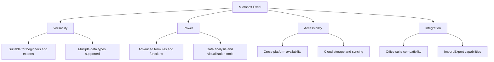
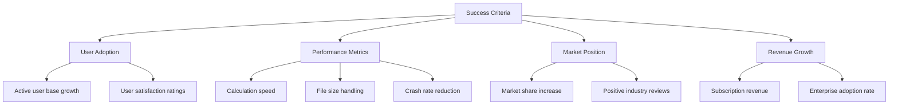
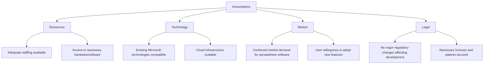
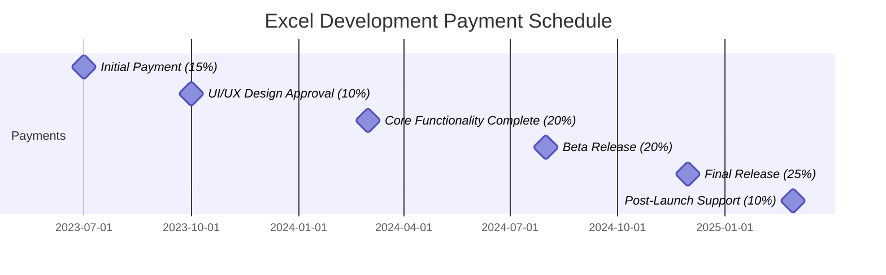
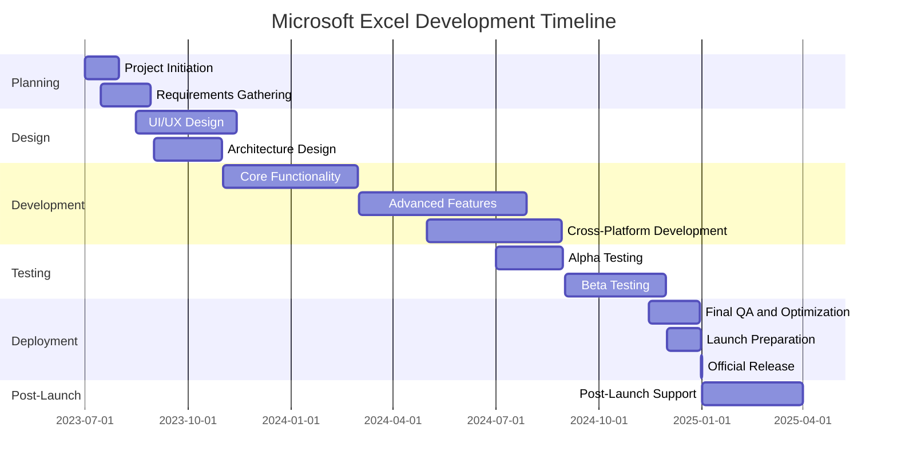

# EXECUTIVE SUMMARY

## PROJECT OVERVIEW

Microsoft Excel is a revolutionary spreadsheet software application designed to transform the way individuals and businesses organize, analyze, and visualize data. In response to the growing need for powerful yet user-friendly data management tools, Excel offers a comprehensive solution that combines intuitive design with advanced functionality. The software addresses the challenges of manual data handling, complex calculations, and limited data visualization options by providing a versatile platform that caters to both novice users and data professionals.

## OBJECTIVES

1. Create a user-friendly interface with a gridded system of cells for effortless data input and manipulation
2. Develop a robust formula system supporting complex calculations and data analysis
3. Implement advanced features including charting, pivot tables, and macros for in-depth data exploration
4. Ensure cross-platform compatibility (Windows, macOS, web, and mobile) with cloud integration
5. Design collaboration features to enable multiple users to work simultaneously on shared spreadsheets
6. Optimize performance to handle large datasets efficiently
7. Integrate seamlessly with other Office suite applications for a cohesive productivity ecosystem

## VALUE PROPOSITION

Microsoft Excel offers unparalleled value through its combination of versatility, power, accessibility, and integration:

1. Versatility: Excel caters to a wide range of users, from beginners to advanced data analysts, providing an adaptable tool for various industries and applications.

2. Power: With its comprehensive formula system, pivot tables, and macro capabilities, Excel empowers users to perform complex data analysis and automate tasks, increasing productivity and decision-making capabilities.

3. Accessibility: Cross-platform support and cloud integration ensure that users can access and work on their spreadsheets from any device, promoting flexibility and collaboration.

4. Integration: Seamless compatibility with other Office suite applications and the ability to import/export various data formats make Excel a central hub for data management and analysis within any organization's software ecosystem.

## PROJECT OBJECTIVES

### BUSINESS GOALS

1. Establish Microsoft Excel as the industry-leading spreadsheet application
2. Increase Microsoft Office suite adoption in both personal and enterprise markets
3. Enhance user productivity across various industries and job functions
4. Drive recurring revenue through subscription-based licensing models
5. Strengthen Microsoft's position in the cloud services market
6. Foster a robust ecosystem of third-party add-ins and integrations

### TECHNICAL GOALS

1. Develop a highly responsive and intuitive user interface
2. Implement a powerful and extensible formula engine
3. Create a scalable architecture to handle large datasets efficiently
4. Ensure cross-platform compatibility (Windows, macOS, web, and mobile)
5. Integrate seamlessly with cloud storage and syncing capabilities
6. Implement real-time collaboration features
7. Develop a comprehensive API for third-party integrations
8. Optimize performance for faster calculation and rendering of complex spreadsheets
9. Implement advanced data analysis features (e.g., pivot tables, data modeling)
10. Enhance data visualization capabilities with dynamic charts and graphs

### SUCCESS CRITERIA

1. User Adoption
   - Achieve a 20% increase in active user base within the first year of release
   - Maintain a user satisfaction rating of 4.5/5 or higher

2. Performance Metrics
   - Reduce calculation time for complex spreadsheets by 30%
   - Support files up to 1GB in size without significant performance degradation
   - Decrease crash rate by 50% compared to previous versions

3. Market Position
   - Increase market share in the spreadsheet software category by 15% within two years
   - Obtain at least three major industry awards for innovation and usability

4. Revenue Growth
   - Achieve a 25% increase in subscription revenue from Excel within the first 18 months
   - Increase enterprise adoption rate by 30% within two years

5. Feature Utilization
   - Attain a 40% adoption rate of new advanced features among existing users
   - Reach 1 million third-party add-in installations within the first year

6. Cross-Platform Usage
   - Achieve a 50% adoption rate of cloud-syncing features among users
   - Attain a 30% usage rate for mobile and web versions among desktop users

7. Collaboration Metrics
   - Reach 5 million concurrent users on shared spreadsheets within six months of release
   - Achieve a 60% adoption rate of real-time collaboration features among enterprise users

# SCOPE OF WORK

## IN-SCOPE

The following tasks, features, and functionalities are included in the Microsoft Excel project:

1. User Interface and Core Functionality
   - Gridded cell system for data input and manipulation
   - Ribbon-style toolbar for easy access to features
   - Support for multiple worksheets within a workbook
   - Cell formatting options (fonts, colors, borders, etc.)
   - Row and column manipulation (insert, delete, resize)

2. Data Types and Formulas
   - Support for various data types (numbers, text, dates, currency)
   - Comprehensive formula system with 400+ built-in functions
   - Auto-fill and drag-and-drop formula copying
   - Named ranges for easy formula referencing

3. Data Analysis and Visualization
   - Sorting and filtering capabilities
   - Pivot tables for data summarization and analysis
   - Charting and graphing tools with 20+ chart types
   - Conditional formatting for data visualization
   - Data validation rules

4. Advanced Features
   - Macro recording and VBA support for automation
   - What-if analysis tools (Goal Seek, Scenario Manager)
   - Data modeling and Power Pivot integration
   - External data connections (databases, web services)

5. Collaboration and Sharing
   - Real-time co-authoring for multiple users
   - Comments and review features
   - Sharing controls and permissions management
   - Version history and recovery

6. Cross-Platform Support
   - Windows desktop application
   - macOS desktop application
   - Web-based version (Excel Online)
   - Mobile applications for iOS and Android

7. Integration and Compatibility
   - Seamless integration with other Office suite applications
   - Import/Export support for various file formats (CSV, XML, PDF)
   - Cloud storage and syncing with OneDrive

8. Performance and Scalability
   - Optimization for large datasets (1M+ rows)
   - Multi-threaded calculation engine
   - 64-bit support for increased memory usage

9. Security and Compliance
   - Data encryption at rest and in transit
   - Compliance with industry standards (GDPR, HIPAA)
   - Advanced threat protection integration

10. Accessibility
    - Screen reader support
    - High contrast modes
    - Keyboard navigation enhancements

## OUT-OF-SCOPE

The following items are explicitly excluded from the project scope:

1. Development of custom add-ins or third-party integrations
2. Training programs or extensive user documentation (beyond basic help files)
3. Data migration services from legacy systems
4. Custom report development for specific industries or use cases
5. On-premises server deployment options (focus on cloud-based services)
6. Direct integration with non-Microsoft cloud storage providers
7. Development of industry-specific templates or pre-built solutions
8. Advanced data science or machine learning capabilities
9. Blockchain or cryptocurrency-related features
10. Virtual or augmented reality data visualization tools

## ASSUMPTIONS

1. Resources
   - Adequate staffing with required skills is available throughout the project
   - Necessary development and testing environments are accessible

2. Technology
   - Existing Microsoft technologies and frameworks are compatible with the project requirements
   - Cloud infrastructure can scale to support the expected user base

3. Market
   - Continued strong market demand for spreadsheet software
   - Users are willing to adopt new features and potentially migrate from competing products

4. Legal and Compliance
   - No major regulatory changes will occur during development that significantly impact the project
   - All necessary software licenses and patents are secured or can be obtained

5. Stakeholder Support
   - Ongoing executive support and timely decision-making from key stakeholders
   - User feedback can be obtained for iterative improvements

6. Integration
   - Other Microsoft Office suite applications will be compatible with new Excel features
   - Third-party developers will create add-ins and integrations post-launch

7. Performance
   - Hardware improvements will continue to support increased software capabilities
   - Internet connectivity will be sufficient for cloud-based features in target markets

## DEPENDENCIES

| Dependency | Type | Description | Potential Impact |
|------------|------|-------------|-------------------|
| Windows OS Development | Internal | Coordination with Windows team for optimal integration | May affect timeline for Windows-specific features |
| Office Suite Compatibility | Internal | Ensuring seamless integration with other Office applications | Could delay release if compatibility issues arise |
| Cloud Infrastructure | Internal | Reliance on Microsoft Azure for cloud-based features | Scalability and performance may be affected by Azure capabilities |
| Third-party Libraries | External | Usage of specific third-party components or libraries | Version changes or discontinuation could require code adjustments |
| Web Browsers | External | Compatibility with major web browsers for Excel Online | Browser updates may necessitate ongoing adjustments |
| Mobile OS Support | External | Dependency on iOS and Android for mobile app functionality | OS updates may require app modifications |
| Data Exchange Formats | External | Support for industry-standard file formats (e.g., ODF) | Changes in standards may require updates to import/export features |
| Regulatory Compliance | External | Adherence to data protection and privacy regulations | New regulations may necessitate feature modifications |
| Hardware Capabilities | External | Reliance on CPU/GPU advancements for performance improvements | Hardware limitations may constrain certain feature implementations |
| User Feedback | External | Incorporation of user testing and feedback for refinements | Significant user issues discovered late may impact release schedule |

# BUDGET AND COST ESTIMATES

## COST BREAKDOWN

The following table provides a detailed breakdown of the estimated costs for the Microsoft Excel project:

| Category | Description | Cost (USD) |
|----------|-------------|------------|
| Labor | Development Team (50 developers x 18 months) | $13,500,000 |
| | UI/UX Design Team (10 designers x 12 months) | $1,800,000 |
| | Quality Assurance Team (20 testers x 15 months) | $3,600,000 |
| | Project Management (5 managers x 18 months) | $1,350,000 |
| | DevOps and Infrastructure (10 engineers x 18 months) | $2,700,000 |
| Software and Tools | Development environments, licenses, and tools | $500,000 |
| Hardware | Development and testing hardware | $300,000 |
| Cloud Infrastructure | Azure services for development and testing | $1,000,000 |
| Third-party Services | API integrations, data providers | $400,000 |
| User Research | Focus groups, usability testing | $250,000 |
| Marketing and Launch | Pre-launch marketing, launch events | $2,000,000 |
| Contingency | 10% of total budget for unforeseen expenses | $2,740,000 |
| **Total** | | **$30,140,000** |

## PAYMENT SCHEDULE

The payment schedule is structured around key project milestones and deliverables:

1. Initial Payment (15%): $4,521,000 - Due at project kickoff
2. UI/UX Design Approval (10%): $3,014,000 - Due upon approval of final UI/UX designs
3. Core Functionality Complete (20%): $6,028,000 - Due when basic spreadsheet functionality is implemented
4. Beta Release (20%): $6,028,000 - Due at the start of beta testing phase
5. Final Release (25%): $7,535,000 - Due upon official product launch
6. Post-Launch Support (10%): $3,014,000 - Due three months after launch, upon completion of initial support phase

## BUDGET CONSIDERATIONS

Several factors could impact the budget and require careful management:

1. Scope Creep: As the project progresses, there may be pressure to add features beyond the initial scope. This will be managed through strict change control processes and clear communication with stakeholders about the impact on budget and timeline.

2. Technology Changes: Rapid advancements in cloud technology or competing products may necessitate adjustments to the project plan. A portion of the contingency budget is reserved for potential pivots in technology strategy.

3. Integration Challenges: Unforeseen difficulties in integrating Excel with other Office suite applications or third-party services could require additional development time. Regular integration testing and early identification of issues will help mitigate this risk.

4. Performance Optimization: Achieving the desired performance levels for large datasets may require more extensive optimization efforts than initially estimated. Performance benchmarks will be established early and monitored throughout development.

5. Cross-Platform Development: Ensuring consistent functionality and user experience across all platforms (Windows, macOS, web, mobile) may present unexpected challenges. A modular development approach and comprehensive cross-platform testing strategy will be employed to address this.

6. Regulatory Compliance: Changes in data protection regulations or industry standards may require additional features or security measures. The legal team will closely monitor regulatory landscapes to anticipate and plan for any necessary adjustments.

7. User Feedback: Significant changes based on beta user feedback could impact the final development phases. A buffer is included in the timeline and budget to accommodate critical user-requested modifications.

8. Currency Fluctuations: For international team members or services, currency exchange rate fluctuations could affect labor costs. Where possible, contracts will be established in USD to minimize this risk.

9. Licensing Costs: Unexpected increases in third-party licensing fees could impact the overall budget. Long-term agreements will be negotiated where possible to lock in costs.

10. Cloud Infrastructure Scaling: As the product gains popularity, cloud infrastructure costs may escalate more quickly than anticipated. The DevOps team will implement cost optimization strategies and closely monitor usage to prevent unexpected spikes in cloud expenses.

To manage these considerations, the project will maintain a risk register with mitigation strategies for each identified risk. The contingency budget provides a buffer for addressing unforeseen issues, and regular budget reviews will be conducted to ensure the project remains on track financially.

## PROJECT TIMELINE

## KEY MILESTONES

| Milestone | Description | Target Date |
|-----------|-------------|-------------|
| Project Kickoff | Official start of the project | 2023-07-01 |
| Requirements Finalization | Completion of detailed project requirements | 2023-08-30 |
| UI/UX Design Approval | Finalization of user interface and experience design | 2023-11-15 |
| Architecture Sign-off | Approval of technical architecture and design | 2023-10-30 |
| Core Functionality Complete | Basic spreadsheet features implemented | 2024-03-01 |
| Advanced Features Integration | Complex features like pivot tables and macros implemented | 2024-07-30 |
| Cross-Platform Compatibility | Excel functional across Windows, macOS, web, and mobile | 2024-08-30 |
| Alpha Release | Internal testing version ready | 2024-08-30 |
| Beta Release | External user testing version launched | 2024-09-01 |
| Performance Optimization Complete | Final optimizations for large datasets and calculations | 2024-12-15 |
| Marketing Campaign Launch | Begin pre-release marketing activities | 2024-12-01 |
| Official Product Launch | Public release of Microsoft Excel | 2024-12-31 |
| Post-Launch Review | Evaluation of launch success and user feedback | 2025-03-31 |

## CRITICAL PATH

The following tasks represent the critical path for the Microsoft Excel project:

1. Requirements Gathering and Analysis
   - Critical for defining the scope and features of Excel
   - Delays here will impact all subsequent phases

2. UI/UX Design
   - Forms the basis for user interaction and experience
   - Must be completed before core development can fully commence

3. Core Functionality Development
   - Includes the basic spreadsheet features and calculation engine
   - Essential for all other features to build upon

4. Formula System Implementation
   - Critical for Excel's primary functionality
   - Needs to be robust and extensible for future feature additions

5. Cross-Platform Development
   - Ensures Excel works consistently across all targeted platforms
   - Delays could significantly impact the release schedule

6. Performance Optimization
   - Crucial for handling large datasets and complex calculations
   - Needs to meet or exceed performance benchmarks for release approval

7. Beta Testing
   - Provides essential user feedback and bug identification
   - Critical for ensuring product quality and user satisfaction

8. Final QA and Bug Fixing
   - Last opportunity to address critical issues before release
   - Directly impacts the quality of the launched product

9. Launch Preparation and Deployment
   - Includes final approvals, documentation, and release processes
   - Any delays here directly affect the public release date

Maintaining progress on these critical path items is essential for keeping the project on schedule. Regular monitoring and proactive management of these tasks will be crucial for the timely delivery of Microsoft Excel.

# DELIVERABLES

## LIST OF DELIVERABLES

1. Software Components
   - Microsoft Excel Desktop Application (Windows and macOS versions)
   - Microsoft Excel Online (Web version)
   - Microsoft Excel Mobile Applications (iOS and Android)
   - Excel API for third-party integrations

2. Documentation
   - Technical Specification Document
   - User Manual
   - API Documentation
   - System Architecture Document
   - Database Schema Documentation

3. Training Materials
   - Video Tutorials
   - Interactive Online Training Modules
   - Quick Start Guide
   - Advanced Features Guide

4. Testing and Quality Assurance
   - Test Plans and Test Cases
   - Bug Reports and Resolution Documentation
   - Performance Benchmark Reports

5. Deployment and Support
   - Deployment Guide
   - Troubleshooting Guide
   - Release Notes

6. Marketing and Communication
   - Product Brochures
   - Feature Highlight Sheets
   - Press Release Kit

## DELIVERY SCHEDULE

| Deliverable | Expected Completion Date |
|-------------|--------------------------|
| Technical Specification Document | 2023-09-15 |
| UI/UX Design Mockups | 2023-11-15 |
| Excel Core Engine (Alpha Version) | 2024-02-28 |
| Desktop Application (Windows) - Beta | 2024-06-30 |
| Desktop Application (macOS) - Beta | 2024-07-15 |
| Excel Online (Web Version) - Beta | 2024-08-15 |
| Mobile Applications (iOS and Android) - Beta | 2024-09-30 |
| API and Documentation | 2024-10-15 |
| User Manual and Training Materials | 2024-11-15 |
| Final QA Reports | 2024-12-15 |
| Release Candidate (All Platforms) | 2024-12-20 |
| Official Release | 2024-12-31 |
| Post-Launch Support Documentation | 2025-01-31 |

## ACCEPTANCE CRITERIA

```mermaid
graph TD
    A[Acceptance Criteria] --> B[Functionality]
    A --> C[Performance]
    A --> D[Usability]
    A --> E[Compatibility]
    A --> F[Documentation]

    B --> B1[All specified features implemented]
    B --> B2[Formula system accuracy]
    B --> B3[Data integrity maintained]

    C --> C1[Load time under 3 seconds]
    C --> C2[Handle 1M+ rows without lag]
    C --> C3[Calculation speed benchmarks met]

    D --> D1[Intuitive UI verified by user testing]
    D --> D2[Accessibility standards met]
    D --> D3[Help system comprehensiveness]

    E --> E1[Cross-platform consistency]
    E --> E2[File format compatibility]
    E --> E3[Third-party integration success]

    F --> F1[Documentation completeness]
    F --> F2[Technical accuracy]
    F --> F3[User guide clarity]
```

1. Functionality
   - All specified features are implemented and working as described in the Technical Specification Document
   - Formula system produces accurate results for all supported functions
   - Data integrity is maintained during all operations, including multi-user editing

2. Performance
   - Application load time is under 3 seconds on specified minimum hardware
   - Can handle spreadsheets with 1 million+ rows without significant performance degradation
   - Calculation speed meets or exceeds defined benchmarks

3. Usability
   - User interface is intuitive and consistent, verified through user testing with 90% task completion rate
   - Accessibility standards (WCAG 2.1 Level AA) are met for web and mobile versions
   - Help system provides comprehensive coverage of all features

4. Compatibility
   - Consistent functionality and user experience across all specified platforms (Windows, macOS, web, iOS, Android)
   - Successful import/export of all supported file formats without data loss
   - Seamless integration with other Office suite applications

5. Documentation
   - All documentation is complete, technically accurate, and free of errors
   - User manual covers all features and common use cases
   - API documentation is comprehensive and includes working examples

6. Security and Compliance
   - Passes all specified security tests, including penetration testing
   - Complies with relevant data protection regulations (e.g., GDPR, CCPA)
   - Encryption implemented correctly for data at rest and in transit

7. Localization
   - Correctly displays and functions with all supported languages and regional settings
   - No localization errors in user interface or documentation

8. Testing and Quality Assurance
   - Passes 100% of critical test cases and 95% of all test cases
   - No critical or high-priority bugs remain unresolved
   - Stress testing completed with acceptable results

9. Deployment
   - Successful deployment on all specified platforms with automated update capability
   - Backward compatibility maintained with previous version file formats

10. User Satisfaction
    - Achieves a user satisfaction score of 4.5/5 or higher in beta testing
    - Receives positive feedback on new features from 80% of beta testers

Each deliverable will be reviewed against these criteria, and formal acceptance will require sign-off from designated stakeholders, including project managers, quality assurance leads, and client representatives.