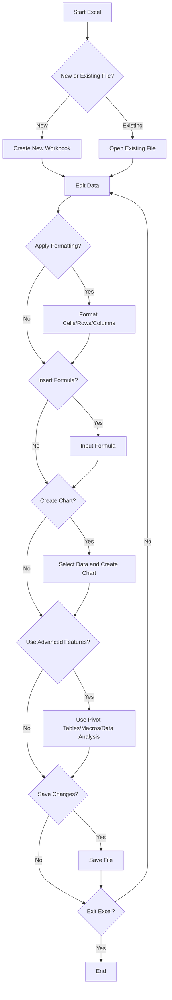
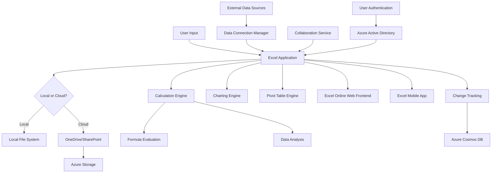

# INTRODUCTION

## PURPOSE

The purpose of this Software Requirements Specification (SRS) document is to provide a comprehensive and detailed description of the Microsoft Excel spreadsheet application. This document serves as the primary reference for the development team, project managers, quality assurance personnel, and other stakeholders involved in the creation and deployment of Microsoft Excel.

This SRS aims to:

1. Clearly define the functional and non-functional requirements of Microsoft Excel
2. Establish a shared understanding of the project scope and objectives among all stakeholders
3. Serve as a basis for project planning, cost estimation, and resource allocation
4. Provide a benchmark for validating the final product against the initial requirements
5. Act as a contractual agreement between the development team and stakeholders

The intended audience for this document includes:

- Software developers and engineers
- Project managers and team leads
- Quality assurance and testing teams
- User experience (UX) and user interface (UI) designers
- Technical writers and documentation specialists
- Executive stakeholders and decision-makers
- Potential third-party integrators and API consumers

## SCOPE

Microsoft Excel is a powerful and versatile spreadsheet application designed to revolutionize data management, analysis, and visualization for individuals and businesses across various industries. The software aims to provide an intuitive yet robust platform for organizing, calculating, and deriving insights from structured data.

### Goals

1. Create a user-friendly interface that caters to both novice users and data professionals
2. Develop a comprehensive set of tools for data manipulation, analysis, and visualization
3. Ensure cross-platform compatibility and seamless integration with other productivity applications
4. Implement advanced features that push the boundaries of traditional spreadsheet functionality
5. Establish Microsoft Excel as the industry-leading spreadsheet solution

### Benefits

- Increased productivity through efficient data organization and analysis
- Enhanced decision-making capabilities with powerful data visualization tools
- Improved collaboration through real-time co-authoring and sharing features
- Reduced errors and increased accuracy in complex calculations
- Seamless integration with other Microsoft Office applications for a cohesive workflow
- Accessibility across multiple devices and platforms

### Core Functionalities

1. Data Input and Management
   - Gridded cell system for structured data entry
   - Support for various data types (numbers, text, dates, currency)
   - Multiple worksheets within a single workbook

2. Calculation and Formula System
   - Comprehensive formula library with 400+ built-in functions
   - Custom formula creation capabilities
   - Automatic recalculation and formula error checking

3. Data Analysis Tools
   - Sorting and filtering options
   - Pivot tables for data summarization and analysis
   - What-if analysis tools (Goal Seek, Scenario Manager)
   - Data modeling and Power Pivot integration

4. Visualization and Formatting
   - Wide range of chart and graph types for data visualization
   - Conditional formatting for visual data analysis
   - Cell, row, and column formatting options

5. Automation and Customization
   - Macro recording and VBA support for task automation
   - Custom function creation
   - Add-in support for extended functionality

6. Collaboration and Sharing
   - Real-time co-authoring for multiple users
   - Comments and review features
   - Version history and recovery options
   - Sharing controls and permissions management

7. Cross-Platform Support
   - Desktop applications for Windows and macOS
   - Web-based version (Excel Online)
   - Mobile applications for iOS and Android devices

8. Integration and Compatibility
   - Seamless integration with other Microsoft Office applications
   - Import/Export support for various file formats
   - External data connections to databases and web services

9. Performance and Scalability
   - Optimization for large datasets (1M+ rows)
   - Multi-threaded calculation engine
   - 64-bit support for increased memory usage

10. Security and Compliance
    - Data encryption at rest and in transit
    - Compliance with industry standards (GDPR, HIPAA)
    - Advanced threat protection integration

By delivering these core functionalities, Microsoft Excel aims to provide a comprehensive solution for data management and analysis, catering to a wide range of users and use cases across various industries and professions.

# PRODUCT DESCRIPTION

## PRODUCT PERSPECTIVE

Microsoft Excel is a cornerstone application within the Microsoft Office suite, designed to work seamlessly with other Office applications while also functioning as a standalone product. It operates within the broader ecosystem of Microsoft's productivity tools and cloud services, particularly integrating with:

1. Microsoft 365: Excel is a key component of the Microsoft 365 subscription service, offering cloud-based features and regular updates.

2. OneDrive: Provides cloud storage and synchronization capabilities, allowing users to access their Excel files from any device.

3. SharePoint: Enables collaborative workspaces for sharing and managing Excel documents within organizations.

4. Power BI: Allows for advanced data analysis and visualization, extending Excel's capabilities for business intelligence.

5. Microsoft Teams: Facilitates real-time collaboration on Excel spreadsheets within the communication platform.

6. Azure: Leverages Microsoft's cloud infrastructure for data processing, storage, and advanced analytics features.

Excel is designed to be cross-platform compatible, with versions available for:

- Windows desktop
- macOS desktop
- Web browsers (Excel Online)
- iOS and Android mobile devices

This multi-platform approach ensures that users can access and work with their spreadsheets across various devices and operating systems, maintaining a consistent experience and feature set.

## PRODUCT FUNCTIONS

Microsoft Excel provides a wide range of functions to support data management, analysis, and visualization. The main functions include:

1. Data Input and Management
   - Gridded cell system for structured data entry
   - Support for various data types (numbers, text, dates, currency)
   - Multiple worksheets within a single workbook
   - Data validation and error checking

2. Calculation and Formula System
   - Comprehensive formula library with 400+ built-in functions
   - Custom formula creation capabilities
   - Automatic recalculation and formula error checking
   - Array formulas and dynamic arrays

3. Data Analysis Tools
   - Sorting and filtering options
   - Pivot tables for data summarization and analysis
   - What-if analysis tools (Goal Seek, Scenario Manager)
   - Data modeling and Power Pivot integration
   - Statistical analysis functions

4. Visualization and Formatting
   - Wide range of chart and graph types for data visualization
   - Conditional formatting for visual data analysis
   - Cell, row, and column formatting options
   - Sparklines for inline data visualization

5. Automation and Customization
   - Macro recording and VBA support for task automation
   - Custom function creation
   - Add-in support for extended functionality

6. Collaboration and Sharing
   - Real-time co-authoring for multiple users
   - Comments and review features
   - Version history and recovery options
   - Sharing controls and permissions management

7. Data Connectivity and Import/Export
   - Import data from various sources (databases, web services, text files)
   - Export data to multiple formats (CSV, PDF, XML)
   - Refresh data connections to keep information up-to-date

8. Security and Protection
   - Workbook and worksheet protection options
   - Data encryption capabilities
   - Digital signatures for workbook authentication

## USER CHARACTERISTICS

Microsoft Excel caters to a diverse user base with varying levels of expertise and needs:

1. Novice Users
   - Characteristics: Limited spreadsheet experience, primarily using basic functions
   - Needs: Intuitive interface, simple data entry, basic calculations, and formatting
   - Persona: Sarah, a small business owner who uses Excel for basic bookkeeping and inventory tracking

2. Intermediate Users
   - Characteristics: Comfortable with common Excel features, some experience with formulas and charts
   - Needs: More advanced formulas, data analysis tools, and basic macros
   - Persona: Mark, a marketing analyst who uses Excel for campaign performance tracking and reporting

3. Advanced Users
   - Characteristics: Proficient in complex Excel features, including VBA and advanced data modeling
   - Needs: Advanced analytics, custom function development, and integration with other data sources
   - Persona: Lisa, a financial analyst who develops complex financial models and automates reporting processes

4. Data Scientists / Analysts
   - Characteristics: Highly skilled in data manipulation and statistical analysis
   - Needs: Large dataset handling, advanced statistical functions, and integration with other analytical tools
   - Persona: David, a data scientist who uses Excel as part of his data preprocessing and exploratory data analysis workflow

5. IT Professionals
   - Characteristics: Focus on system integration, security, and deployment
   - Needs: API access, enterprise deployment tools, and security features
   - Persona: Alex, an IT manager responsible for deploying and managing Excel across a large organization

6. Educators / Students
   - Characteristics: Use Excel for teaching or learning data analysis and business concepts
   - Needs: Educational resources, templates, and accessible features for various skill levels
   - Persona: Professor Johnson, who teaches business statistics and uses Excel in her curriculum

## CONSTRAINTS

1. Technical Constraints
   - Must maintain backward compatibility with previous Excel file formats
   - Performance optimization required for handling large datasets (1M+ rows) on various hardware configurations
   - Mobile versions must function within the memory and processing limitations of mobile devices

2. Regulatory Constraints
   - Must comply with data protection regulations such as GDPR, CCPA, and HIPAA
   - Accessibility features must meet WCAG 2.1 Level AA standards

3. Integration Constraints
   - Must integrate seamlessly with other Microsoft Office applications and maintain feature parity where applicable
   - API must support current third-party integrations without breaking changes

4. User Interface Constraints
   - Must maintain consistency with the Microsoft Office suite UI design language
   - Mobile versions need to adapt to smaller screen sizes without sacrificing core functionality

5. Security Constraints
   - Must implement encryption for data at rest and in transit
   - Need to provide granular permission controls for shared workbooks

6. Localization Constraints
   - Must support multiple languages and regional settings, including right-to-left languages
   - Formulas and functions need to work correctly across different locales

7. Cloud Service Constraints
   - Online features must operate within the limitations of browser technologies
   - Need to manage potential latency issues for real-time collaboration features

8. Licensing Constraints
   - Features must align with different licensing tiers (e.g., Microsoft 365 Personal vs. Business vs. Enterprise)

9. Update and Deployment Constraints
   - Must support automated updates while ensuring minimal disruption to users
   - Enterprise deployments need to support customization and controlled rollout options

## ASSUMPTIONS AND DEPENDENCIES

### Assumptions

1. Users have basic computer literacy and familiarity with spreadsheet concepts
2. The majority of users have reliable internet connectivity for cloud-based features
3. Hardware capabilities will continue to improve, supporting more complex calculations and larger datasets
4. Users are willing to adopt new features and potentially migrate from competing products
5. The demand for data analysis and visualization tools will continue to grow across various industries

### Dependencies

1. Microsoft Azure: Reliance on Azure cloud services for online features, storage, and computational capabilities
2. Office Suite Integration: Dependence on other Microsoft Office applications for seamless integration and data exchange
3. Operating System Support: Ongoing support and compatibility with Windows, macOS, iOS, and Android operating systems
4. Third-party Libraries: Utilization of specific third-party components or libraries for certain functionalities
5. Web Browser Technologies: Compatibility with and support from major web browsers for Excel Online
6. Hardware Advancements: Dependence on CPU/GPU improvements for enhanced performance and feature support
7. Regulatory Compliance: Ongoing adherence to evolving data protection and privacy regulations
8. User Feedback: Incorporation of user testing and feedback for continuous improvement and feature refinement
9. Microsoft Account System: Reliance on Microsoft's account management and authentication systems for user access and licensing
10. Developer Ecosystem: Dependence on third-party developers for creating add-ins and extending Excel's functionality

Here's a PROCESS FLOWCHART section for the Microsoft Excel SRS using Mermaid JS, maintaining consistency with the previously mentioned technology and framework choices:

## PROCESS FLOWCHART

The following flowchart illustrates the high-level process flow for key operations in Microsoft Excel:



This flowchart outlines the basic workflow of Microsoft Excel, including:

1. Starting Excel and choosing between creating a new workbook or opening an existing file
2. Editing data in the spreadsheet
3. Applying formatting to cells, rows, or columns
4. Inserting formulas for calculations
5. Creating charts and graphs for data visualization
6. Using advanced features such as pivot tables, macros, and data analysis tools
7. Saving changes and potentially exiting the application

The process flow demonstrates the core functionality of Excel while allowing for various user paths and decision points. This flowchart aligns with the previously mentioned features and capabilities of Microsoft Excel, including its data input, formatting, formula system, charting capabilities, and advanced analysis tools.

The circular nature of the flowchart (returning to the "Edit Data" step) reflects the iterative process of working with spreadsheets, where users often switch between different tasks and features during a single session.

This high-level flowchart can be further expanded to include more detailed sub-processes for specific features or operations as needed in the final SRS document.

Here's a breakdown of Microsoft Excel's features with the requested sub-sections:

1. Data Input and Management

ID: F001
DESCRIPTION: Core spreadsheet functionality allowing users to input, edit, and organize data in a grid-based format.
PRIORITY: High

| Requirement ID | Requirement Description |
|----------------|--------------------------|
| F001-1 | Support for multiple data types (numbers, text, dates, currency) |
| F001-2 | Ability to create, delete, and rename worksheets |
| F001-3 | Cell formatting options (font, color, borders, etc.) |
| F001-4 | Copy, cut, and paste functionality with format painter |
| F001-5 | Undo and redo capabilities for all actions |

2. Formula and Calculation Engine

ID: F002
DESCRIPTION: Comprehensive system for performing calculations and data analysis using formulas and functions.
PRIORITY: High

| Requirement ID | Requirement Description |
|----------------|--------------------------|
| F002-1 | Support for 400+ built-in functions across various categories |
| F002-2 | Custom formula creation capabilities |
| F002-3 | Automatic recalculation and formula error checking |
| F002-4 | Array formulas and dynamic arrays support |
| F002-5 | Formula auditing tools (trace precedents/dependents) |

3. Data Visualization and Charting

ID: F003
DESCRIPTION: Tools for creating visual representations of data through various chart types and conditional formatting.
PRIORITY: High

| Requirement ID | Requirement Description |
|----------------|--------------------------|
| F003-1 | Support for 20+ chart types (bar, line, pie, scatter, etc.) |
| F003-2 | Customizable chart elements (titles, legends, axes) |
| F003-3 | Conditional formatting with data bars, color scales, and icon sets |
| F003-4 | Sparklines for inline data visualization |
| F003-5 | Advanced chart features (trendlines, error bars, secondary axes) |

4. Data Analysis Tools

ID: F004
DESCRIPTION: Advanced features for analyzing and summarizing large datasets.
PRIORITY: Medium

| Requirement ID | Requirement Description |
|----------------|--------------------------|
| F004-1 | Pivot Tables for data summarization and analysis |
| F004-2 | Data sorting and filtering options |
| F004-3 | What-if analysis tools (Goal Seek, Scenario Manager) |
| F004-4 | Data modeling and Power Pivot integration |
| F004-5 | Statistical analysis functions |

5. Collaboration and Sharing

ID: F005
DESCRIPTION: Features enabling multiple users to work on spreadsheets simultaneously and share their work.
PRIORITY: Medium

| Requirement ID | Requirement Description |
|----------------|--------------------------|
| F005-1 | Real-time co-authoring for multiple users |
| F005-2 | Comments and review features |
| F005-3 | Version history and recovery options |
| F005-4 | Sharing controls and permissions management |
| F005-5 | Integration with Microsoft Teams for collaborative workflows |

6. Automation and Customization

ID: F006
DESCRIPTION: Tools for automating repetitive tasks and extending Excel's functionality.
PRIORITY: Medium

| Requirement ID | Requirement Description |
|----------------|--------------------------|
| F006-1 | Macro recording for task automation |
| F006-2 | VBA support for custom programming |
| F006-3 | Custom function creation |
| F006-4 | Add-in support for extended functionality |
| F006-5 | Power Query for advanced data import and transformation |

7. Cross-Platform Compatibility

ID: F007
DESCRIPTION: Ensure Excel functions consistently across various platforms and devices.
PRIORITY: High

| Requirement ID | Requirement Description |
|----------------|--------------------------|
| F007-1 | Windows desktop application |
| F007-2 | macOS desktop application |
| F007-3 | Web-based version (Excel Online) |
| F007-4 | Mobile applications for iOS and Android |
| F007-5 | Feature parity and file compatibility across all platforms |

8. Data Connectivity and Import/Export

ID: F008
DESCRIPTION: Capabilities for connecting to external data sources and exchanging data with other formats.
PRIORITY: Medium

| Requirement ID | Requirement Description |
|----------------|--------------------------|
| F008-1 | Import data from various sources (databases, web services, text files) |
| F008-2 | Export data to multiple formats (CSV, PDF, XML) |
| F008-3 | Refresh data connections to keep information up-to-date |
| F008-4 | Support for OData and REST API connections |
| F008-5 | Integration with Microsoft Power BI for advanced analytics |

9. Security and Compliance

ID: F009
DESCRIPTION: Features ensuring data protection, user authentication, and regulatory compliance.
PRIORITY: High

| Requirement ID | Requirement Description |
|----------------|--------------------------|
| F009-1 | Data encryption at rest and in transit |
| F009-2 | Compliance with industry standards (GDPR, HIPAA) |
| F009-3 | Advanced threat protection integration |
| F009-4 | Workbook and worksheet protection options |
| F009-5 | Digital signatures for workbook authentication |

10. Performance and Scalability

ID: F010
DESCRIPTION: Optimizations to handle large datasets and complex calculations efficiently.
PRIORITY: High

| Requirement ID | Requirement Description |
|----------------|--------------------------|
| F010-1 | Support for 1M+ rows of data |
| F010-2 | Multi-threaded calculation engine |
| F010-3 | 64-bit support for increased memory usage |
| F010-4 | Intelligent caching and data loading mechanisms |
| F010-5 | Performance monitoring and optimization tools |

This feature breakdown maintains consistency with the previously mentioned technology and framework choices, including the use of Microsoft Azure for cloud services, integration with other Office suite applications, and support for various platforms (Windows, macOS, web, and mobile).

# NON-FUNCTIONAL REQUIREMENTS

## PERFORMANCE

1. Response Time
   - Excel shall load and become fully operational within 3 seconds on the minimum recommended hardware configuration.
   - Formula calculations shall complete within 100 milliseconds for spreadsheets up to 100,000 cells.
   - Chart rendering shall occur within 500 milliseconds for datasets up to 10,000 data points.

2. Throughput
   - The system shall support concurrent editing by up to 100 users on a single spreadsheet without degradation in performance.
   - Excel Online shall handle up to 10,000 simultaneous active users across all spreadsheets.

3. Resource Usage
   - Desktop versions shall not consume more than 2GB of RAM for spreadsheets up to 1 million cells.
   - CPU usage shall not exceed 25% during idle states and 80% during complex calculations.
   - Mobile versions shall not consume more than 100MB of device storage and 256MB of RAM during normal operation.

## SAFETY

1. Data Integrity
   - Excel shall implement auto-save functionality, creating backups every 5 minutes during active editing.
   - In case of unexpected application closure, Excel shall recover unsaved changes upon next launch with 99.9% accuracy.

2. Error Handling
   - The system shall gracefully handle and log all exceptions without crashing.
   - Users shall be presented with clear, non-technical error messages and suggested actions in case of failures.

3. Data Recovery
   - Excel shall maintain a version history for the last 30 days, allowing users to revert to previous versions of their spreadsheets.
   - The system shall provide a file recovery tool capable of repairing corrupted Excel files with a success rate of at least 90%.

## SECURITY

1. Authentication
   - Excel shall support multi-factor authentication for Microsoft account logins.
   - The system shall enforce strong password policies, requiring a minimum of 12 characters, including uppercase, lowercase, numbers, and special characters.

2. Authorization
   - Excel shall implement role-based access control for shared spreadsheets, allowing fine-grained permissions at the cell, sheet, and workbook levels.
   - The system shall support Azure Active Directory for enterprise user management and single sign-on capabilities.

3. Data Encryption
   - All data transmissions between client and server shall be encrypted using TLS 1.3 or higher.
   - Spreadsheets stored in the cloud shall be encrypted at rest using AES-256 encryption.

4. Privacy
   - Excel shall comply with GDPR, CCPA, and other relevant data protection regulations.
   - The system shall provide users with the ability to export and delete their personal data upon request.

## QUALITY

1. Availability
   - Excel Online shall maintain 99.9% uptime, with scheduled maintenance windows communicated at least 7 days in advance.
   - The system shall implement load balancing and failover mechanisms to ensure high availability.

2. Maintainability
   - The codebase shall adhere to Microsoft's coding standards and best practices.
   - The system architecture shall be modular, allowing for easy updates and feature additions without affecting the entire application.

3. Usability
   - Excel shall maintain a System Usability Scale (SUS) score of 80 or higher.
   - The user interface shall be consistent across all platforms (desktop, web, and mobile) with a maximum learning curve of 2 hours for basic operations.

4. Scalability
   - Excel shall support spreadsheets with up to 1,048,576 rows by 16,384 columns.
   - The system architecture shall allow for horizontal scaling to accommodate increased user load without significant code changes.

5. Reliability
   - Excel shall have a Mean Time Between Failures (MTBF) of at least 720 hours of operation.
   - The system shall achieve a bug resolution rate of 95% for critical issues within 48 hours of reporting.

## COMPLIANCE

1. Legal Compliance
   - Excel shall comply with all relevant intellectual property laws and licensing agreements for third-party components.
   - The system shall adhere to local data residency requirements for cloud storage in applicable regions.

2. Regulatory Compliance
   - Excel shall maintain compliance with SOC 2 Type II standards for security, availability, and confidentiality.
   - The system shall implement necessary controls to support customer compliance with industry-specific regulations (e.g., HIPAA, FERPA) when handling sensitive data.

3. Standards Compliance
   - Excel shall support the Open Document Format (ODF) for spreadsheets to ensure interoperability.
   - The system shall adhere to WCAG 2.1 Level AA standards for web accessibility.
   - All APIs shall follow RESTful design principles and be documented using the OpenAPI Specification.

4. Microsoft-Specific Standards
   - Excel shall integrate seamlessly with other Microsoft 365 applications, adhering to Microsoft's design language and UX guidelines.
   - The system shall support Microsoft's Power Platform for extended functionality and automation capabilities.

These non-functional requirements align with the previously mentioned technology choices, including the use of Microsoft Azure for cloud services, integration with other Office suite applications, and support for various platforms (Windows, macOS, web, and mobile). They also reflect the high standards expected of a Microsoft product in terms of performance, security, and compliance.

# DATA REQUIREMENTS

## DATA MODELS

Microsoft Excel's data model is designed to efficiently represent and manage spreadsheet data across various platforms. The following entity-relationship diagram illustrates the core data structures:

```mermaid
erDiagram
    WORKBOOK ||--|{ WORKSHEET : contains
    WORKSHEET ||--|{ CELL : contains
    CELL ||--o| FORMULA : may-have
    CELL ||--o| STYLE : may-have
    WORKSHEET ||--o{ CHART : may-have
    WORKSHEET ||--o{ PIVOT_TABLE : may-have
    WORKBOOK ||--o{ NAMED_RANGE : may-have
    WORKBOOK ||--o{ MACRO : may-have
    USER }|--o{ WORKBOOK : owns
    USER }|--o{ SHARED_WORKBOOK : collaborates-on
    SHARED_WORKBOOK ||--|{ REVISION_HISTORY : tracks
```

Key Entities:

1. WORKBOOK: Represents the main Excel file, containing multiple worksheets and global elements.
2. WORKSHEET: Individual sheets within a workbook, containing cells and objects.
3. CELL: The basic unit of data storage, containing values, formulas, or styles.
4. FORMULA: Represents calculations and functions applied to cells.
5. STYLE: Defines the visual appearance of cells.
6. CHART: Visualizations created from worksheet data.
7. PIVOT_TABLE: Dynamic summary tables for data analysis.
8. NAMED_RANGE: Named references to cell ranges within a workbook.
9. MACRO: Stored VBA scripts for automation.
10. USER: Represents Excel users with access to workbooks.
11. SHARED_WORKBOOK: Workbooks with collaborative editing enabled.
12. REVISION_HISTORY: Tracks changes in shared workbooks.

## DATA STORAGE

Microsoft Excel utilizes a hybrid storage approach to ensure data integrity, performance, and accessibility across various platforms:

1. Local Storage:
   - Desktop versions (Windows and macOS) primarily use local file storage for .xlsx files.
   - Temporary files and auto-recovery information stored locally.
   - Local caching of recently accessed files for improved performance.

2. Cloud Storage:
   - Integration with Microsoft OneDrive for cloud-based file storage.
   - Support for SharePoint document libraries in enterprise environments.
   - Real-time collaboration features leveraging cloud storage.

3. Database Storage:
   - Backend services use Azure SQL Database for storing user account information, sharing permissions, and collaboration metadata.
   - Azure Cosmos DB used for storing real-time collaboration data and change tracking.

Data Retention:
- User files retained indefinitely in personal OneDrive storage or local storage.
- Deleted items retained in "Recycle Bin" for 30 days before permanent deletion.
- Version history for cloud-stored documents retained for 30 days or 100 versions, whichever comes first.

Redundancy and Backup:
- Cloud storage (OneDrive/SharePoint) implements geo-redundant storage with 99.99% availability.
- Automated daily backups of Azure SQL Database and Cosmos DB with 35-day retention.
- Point-in-time restoration capabilities for the last 35 days.

Recovery at Scale:
- Distributed recovery system to handle large-scale data restoration requests.
- Load-balanced recovery services to manage high-volume recovery operations during outages.
- Incremental recovery options to restore specific versions or portions of workbooks.

## DATA PROCESSING

Excel's data processing capabilities are designed to handle large datasets efficiently while maintaining data security and integrity. The following data flow diagram illustrates the high-level data processing within the Excel ecosystem:



Data Security:

1. Encryption:
   - All data in transit encrypted using TLS 1.2 or higher.
   - Data at rest encrypted using AES 256-bit encryption in cloud storage.
   - Local files can be encrypted with user-provided passwords.

2. Access Control:
   - Azure Active Directory integration for user authentication and authorization.
   - Role-based access control (RBAC) for shared workbooks and collaborative features.
   - Granular permissions at the workbook, worksheet, and range levels.

3. Data Loss Prevention (DLP):
   - Integration with Microsoft 365 DLP policies to prevent unauthorized sharing of sensitive data.
   - Automatic classification and protection of documents containing sensitive information.

4. Audit Logging:
   - Comprehensive logging of user actions, including file access, modifications, and sharing events.
   - Integration with Azure Monitor for centralized log management and analysis.

5. Secure External Connections:
   - Encrypted connections to external data sources.
   - Support for OAuth 2.0 for secure authentication with web services.

6. Data Isolation:
   - Multi-tenant architecture with strict data isolation between different organizations and users.
   - Separate storage containers and database partitions for each tenant.

7. Compliance:
   - Adherence to GDPR, CCPA, and other relevant data protection regulations.
   - Support for data residency requirements in specific geographic regions.

8. Secure Collaboration:
   - End-to-end encryption for real-time collaboration features.
   - Temporary, encrypted storage of collaboration data with automatic expiration.

9. Mobile Security:
   - Support for mobile device management (MDM) policies on iOS and Android.
   - Option to prevent local storage of sensitive data on mobile devices.

10. Third-Party Security:
    - Strict vetting and security requirements for third-party add-ins and integrations.
    - Sandboxed execution environment for third-party scripts and macros.

By implementing these data models, storage strategies, and processing security measures, Microsoft Excel ensures robust data management, efficient processing, and strong security across its ecosystem of applications and services. This approach allows Excel to meet the diverse needs of individual users and enterprise customers while maintaining data integrity and confidentiality.

# EXTERNAL INTERFACES

## USER INTERFACES

Microsoft Excel's user interface is designed to be intuitive, efficient, and consistent across all platforms while maintaining platform-specific design guidelines. The interface will include the following key components:

1. Ribbon Interface
   - Contextual tabs for different functionalities (Home, Insert, Page Layout, Formulas, Data, Review, View)
   - Quick Access Toolbar for frequently used commands

2. Formula Bar
   - Displays and allows editing of cell contents and formulas

3. Worksheet Grid
   - Rows and columns for data entry and manipulation
   - Cell selection and range highlighting

4. Sheet Tabs
   - Navigation between multiple worksheets within a workbook

5. Status Bar
   - Displays relevant information and quick calculations

6. Sidebar
   - Context-sensitive pane for additional tools and information (e.g., cell formatting, chart properties)

7. Quick Analysis Tool
   - Floating menu for instant data visualization and analysis options

8. Tell Me Feature
   - Search bar for quickly finding and accessing Excel features

Placeholder for UI Mockups:
[Insert high-fidelity mockups of key interface components here]

Accessibility Considerations:
- High contrast mode support
- Screen reader compatibility
- Keyboard navigation for all functions
- Customizable font sizes and color schemes

Platform-Specific Adaptations:
- Touch-optimized interface for mobile and tablet versions
- Responsive design for Excel Online to accommodate various screen sizes

## HARDWARE INTERFACES

While Microsoft Excel is primarily a software application, it interfaces with various hardware components to enhance user experience and functionality:

1. Input Devices
   - Keyboard: Support for standard and extended keyboard layouts
   - Mouse/Trackpad: Precise cursor control and gesture support
   - Touch Screen: Full touch and multi-touch gesture support for compatible devices
   - Stylus: Precision input support for digital pen devices

2. Display
   - Support for various screen resolutions and aspect ratios
   - Multi-monitor support for extended workspace
   - High DPI and Retina display optimization

3. Storage Devices
   - Local disk drives: For file saving and loading operations
   - Removable storage: Support for USB drives and memory cards

4. Printers
   - Interface with local and network printers for spreadsheet printing
   - Support for various paper sizes and orientations

5. Cameras
   - Integration with device cameras for document scanning and image insertion

6. Biometric Devices
   - Support for fingerprint readers and facial recognition for secure login (where available)

## SOFTWARE INTERFACES

Microsoft Excel will interact with various software systems and components:

1. Operating Systems
   - Windows: Full compatibility with Windows 10 and later versions
   - macOS: Support for macOS 10.15 (Catalina) and later
   - iOS: Compatible with iOS 13 and later
   - Android: Support for Android 8.0 and later

2. Microsoft Office Suite
   - Seamless integration with other Office applications (Word, PowerPoint, Outlook)
   - Shared clipboard and drag-and-drop functionality between applications

3. Cloud Services
   - Microsoft OneDrive: For file storage, syncing, and sharing
   - SharePoint: Integration for enterprise document management

4. Database Systems
   - Direct connection to various database systems (SQL Server, Oracle, MySQL)
   - Support for ODBC and OLE DB for universal database connectivity

5. Web Services
   - RESTful API support for data retrieval and manipulation
   - OAuth 2.0 integration for secure authentication with web services

6. Add-in Ecosystem
   - Support for COM add-ins (Windows)
   - Office.js API for cross-platform add-in development

7. Development Tools
   - Visual Basic for Applications (VBA) integration
   - Support for Power Query and Power Pivot

8. File Systems
   - Interaction with local and network file systems for file operations

9. Web Browsers
   - Excel Online compatibility with major web browsers (Chrome, Firefox, Safari, Edge)

## COMMUNICATION INTERFACES

Microsoft Excel will utilize various communication protocols and methods to ensure seamless data exchange and collaboration:

1. Network Protocols
   - HTTP/HTTPS: For web-based operations and API communications
   - WebSocket: For real-time collaboration features
   - SMB/CIFS: For accessing network file shares

2. Data Exchange Formats
   - XML: For data import/export and file format compatibility
   - JSON: For web service data exchange and API responses
   - CSV: For simple data import and export operations

3. Collaboration Protocols
   - Microsoft Graph API: For integration with Microsoft 365 services
   - WebRTC: For peer-to-peer real-time collaboration features

4. Synchronization
   - Delta sync protocol for efficient cloud file synchronization
   - Conflict resolution mechanisms for simultaneous edits

5. Email Integration
   - SMTP: For sending spreadsheets and notifications via email
   - IMAP/POP3: For receiving data and attachments from email

6. Remote Procedure Calls
   - COM/DCOM: For Windows-based add-in and automation support
   - gRPC: For high-performance, cross-platform procedure calls

7. Authentication Protocols
   - OAuth 2.0: For secure authentication with web services and APIs
   - SAML: For enterprise single sign-on integration

8. Encryption
   - TLS 1.3: For secure data transmission
   - AES-256: For data encryption at rest

9. Printing Protocols
   - IPP (Internet Printing Protocol): For network printing support
   - PCL and PostScript: For wide-ranging printer compatibility

10. Accessibility Interfaces
    - Microsoft UI Automation: For screen reader and assistive technology support

These communication interfaces ensure that Microsoft Excel can efficiently interact with various systems, services, and devices while maintaining security, performance, and compatibility across different platforms and use cases.

# APPENDICES

## GLOSSARY

- Cell: The basic unit of a spreadsheet, where data is entered and stored.
- Formula: An expression that calculates values in a spreadsheet.
- Function: A predefined formula that performs specific calculations.
- Workbook: A file that contains one or more worksheets.
- Worksheet: A single spreadsheet within a workbook.
- Pivot Table: A data summarization tool that can automatically sort, count, total, or average data.
- Macro: A recorded sequence of actions or a custom program written in VBA.
- VBA: Visual Basic for Applications, a programming language used to create macros in Excel.
- Ribbon: The tabbed toolbar at the top of the Excel interface.
- Range: A selection of cells in a worksheet.
- Chart: A graphical representation of data in a spreadsheet.
- Conditional Formatting: A feature that changes the appearance of cells based on their content.
- Data Validation: Rules that control what can be entered into a cell.
- Power Query: A data connection technology used to discover, connect, combine, and refine data sources.
- Power Pivot: An in-memory data modeling component of Excel.

## ACRONYMS

- API: Application Programming Interface
- CSV: Comma-Separated Values
- GDPR: General Data Protection Regulation
- HIPAA: Health Insurance Portability and Accountability Act
- HTML: Hypertext Markup Language
- HTTP: Hypertext Transfer Protocol
- HTTPS: Hypertext Transfer Protocol Secure
- JSON: JavaScript Object Notation
- ODBC: Open Database Connectivity
- ODF: Open Document Format
- OLE DB: Object Linking and Embedding Database
- PDF: Portable Document Format
- REST: Representational State Transfer
- SAML: Security Assertion Markup Language
- SMB: Server Message Block
- SMTP: Simple Mail Transfer Protocol
- SQL: Structured Query Language
- SSL: Secure Sockets Layer
- TLS: Transport Layer Security
- UI: User Interface
- UX: User Experience
- VBA: Visual Basic for Applications
- WCAG: Web Content Accessibility Guidelines
- XML: Extensible Markup Language

## ADDITIONAL REFERENCES

1. Microsoft Excel Documentation: https://docs.microsoft.com/en-us/office/client-developer/excel/

2. Office Open XML File Formats: https://docs.microsoft.com/en-us/office/open-xml/open-xml-sdk

3. Microsoft Graph API Documentation: https://docs.microsoft.com/en-us/graph/

4. Azure Active Directory Documentation: https://docs.microsoft.com/en-us/azure/active-directory/

5. Web Content Accessibility Guidelines (WCAG) 2.1: https://www.w3.org/TR/WCAG21/

6. General Data Protection Regulation (GDPR): https://gdpr-info.eu/

7. Health Insurance Portability and Accountability Act (HIPAA): https://www.hhs.gov/hipaa/index.html

8. RESTful API Design Best Practices: https://docs.microsoft.com/en-us/azure/architecture/best-practices/api-design

9. Microsoft Accessibility Standards: https://www.microsoft.com/en-us/accessibility

10. Open Formula Specification: https://docs.oasis-open.org/office/v1.2/OpenDocument-v1.2-part2.html

These additional references provide in-depth information on various aspects of Excel development, including file formats, APIs, accessibility standards, and regulatory compliance. They serve as valuable resources for the development team and other stakeholders involved in the Microsoft Excel project.