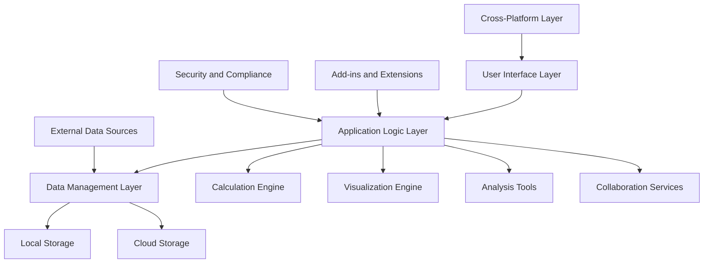
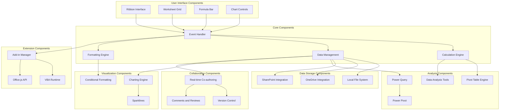
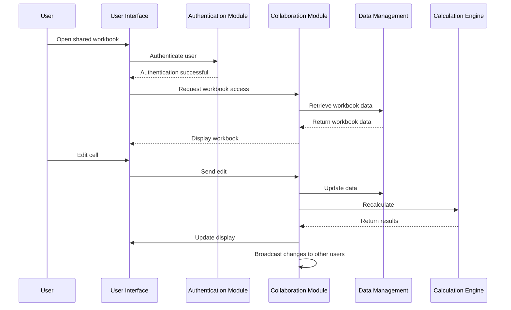
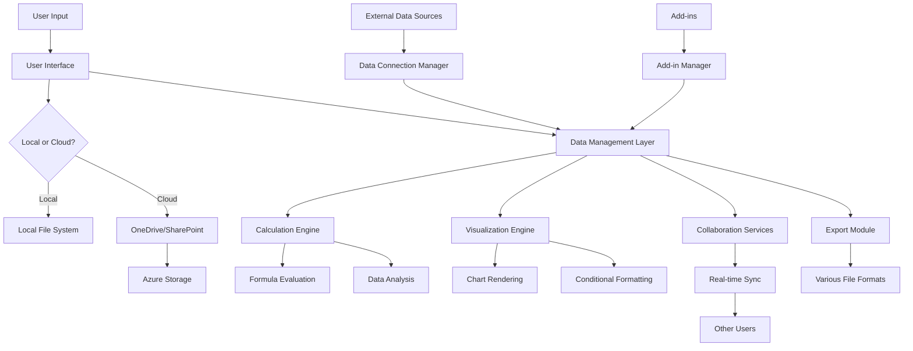
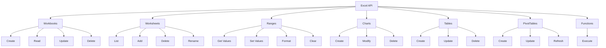
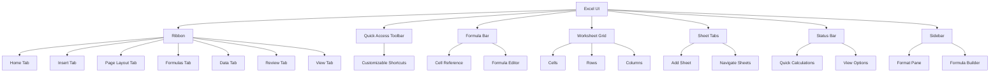
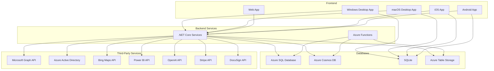
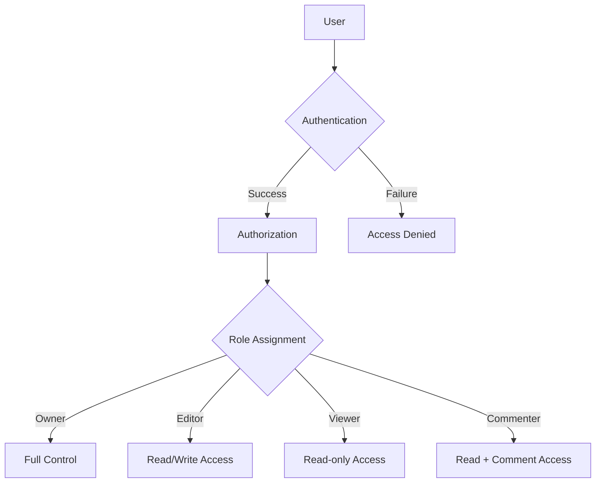
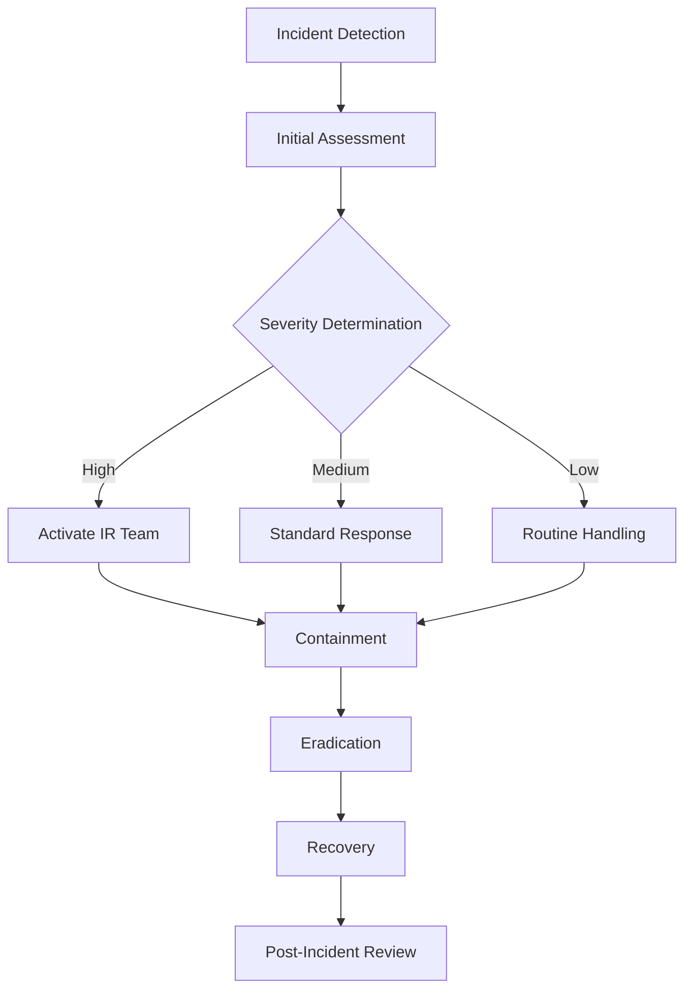

# INTRODUCTION

## SYSTEM OVERVIEW

Microsoft Excel is a comprehensive spreadsheet application designed to provide powerful data management, analysis, and visualization capabilities for users across various platforms. The system is built to handle complex calculations, large datasets, and collaborative workflows while maintaining a user-friendly interface.

### Key Components

1. Core Spreadsheet Engine
2. Formula and Calculation System
3. Data Visualization Tools
4. Analysis and Business Intelligence Features
5. Collaboration and Sharing Platform
6. Cross-Platform Compatibility Layer
7. Cloud Integration Services
8. Security and Compliance Framework

### High-Level Architecture



### Key Features

1. Data Input and Management
   - Grid-based data entry
   - Support for various data types
   - Multiple worksheets within workbooks

2. Calculation and Formula System
   - 400+ built-in functions
   - Custom formula creation
   - Array formulas and dynamic arrays

3. Data Visualization
   - Wide range of chart types
   - Conditional formatting
   - Sparklines and data bars

4. Advanced Analysis Tools
   - Pivot Tables
   - What-if analysis
   - Data modeling with Power Pivot

5. Collaboration and Sharing
   - Real-time co-authoring
   - Version history
   - Commenting and review features

6. Cross-Platform Compatibility
   - Windows and macOS desktop applications
   - Web-based Excel Online
   - Mobile apps for iOS and Android

7. Integration and Extensibility
   - Microsoft 365 integration
   - Add-in support
   - API access for custom solutions

8. Security and Compliance
   - Data encryption
   - Access controls
   - Compliance with regulations (GDPR, HIPAA)

### Technology Stack

| Component | Technology |
|-----------|------------|
| Backend Services | .NET Core, C# |
| Frontend (Desktop) | C++, C# |
| Frontend (Web) | TypeScript, React |
| Frontend (Mobile) | Swift (iOS), Kotlin (Android) |
| Database | Azure SQL Database, Azure Cosmos DB |
| Cloud Services | Microsoft Azure |
| Authentication | Azure Active Directory |
| API | RESTful, gRPC |

### Integration Points

1. Microsoft 365 Suite
2. OneDrive and SharePoint
3. Power BI
4. Microsoft Teams
5. External databases and web services
6. Third-party add-ins and extensions

This system overview provides a high-level description of Microsoft Excel, highlighting its key components, architecture, features, and technology stack. The system is designed to be scalable, secure, and adaptable to meet the diverse needs of individual users and enterprise customers across various platforms and devices.

# SYSTEM ARCHITECTURE

## PROGRAMMING LANGUAGES

Microsoft Excel utilizes a variety of programming languages to ensure optimal performance, cross-platform compatibility, and extensibility. The following table outlines the primary languages used and their justifications:

| Language | Purpose | Justification |
|----------|---------|---------------|
| C++ | Core calculation engine, Windows desktop app | High performance, low-level system access, legacy codebase compatibility |
| C# | Windows desktop app (partial), backend services | Strong typing, performance, extensive .NET ecosystem |
| TypeScript | Web version (Excel Online), cross-platform components | Type safety, improved maintainability for large-scale JavaScript projects |
| Swift | iOS app | Native iOS development, performance, Apple ecosystem integration |
| Kotlin | Android app | Modern Android development, interoperability with Java, concise syntax |
| Python | Data analysis features, extensibility | Rich ecosystem for data science, ease of use for end-user extensibility |
| VBA | Macro programming, backward compatibility | Legacy support, extensive existing codebase |
| SQL | Database queries, data manipulation | Industry standard for relational database interactions |

## HIGH-LEVEL ARCHITECTURE DIAGRAM

The following diagram provides an overview of Microsoft Excel's high-level architecture:


## COMPONENT DIAGRAMS

The following diagram details the specific components within the Microsoft Excel system:



## SEQUENCE DIAGRAMS

The following sequence diagram illustrates the process of opening and editing a shared workbook:



## DATA-FLOW DIAGRAM

The following diagram illustrates how data flows through the Microsoft Excel system:



This data flow diagram shows how user input and external data sources are processed through various components of the Excel system, including local and cloud storage, calculation engine, visualization engine, and collaboration services. It also illustrates how data can be exported to various file formats and shared with other users through real-time synchronization.

# SYSTEM DESIGN

## PROGRAMMING LANGUAGES

Microsoft Excel utilizes a variety of programming languages to ensure optimal performance, cross-platform compatibility, and extensibility. The following table outlines the primary languages used and their justifications:

| Language | Purpose | Justification |
|----------|---------|---------------|
| C++ | Core calculation engine, Windows desktop app | High performance, low-level system access, legacy codebase compatibility |
| C# | Windows desktop app (partial), backend services | Strong typing, performance, extensive .NET ecosystem |
| TypeScript | Web version (Excel Online), cross-platform components | Type safety, improved maintainability for large-scale JavaScript projects |
| Swift | iOS app | Native iOS development, performance, Apple ecosystem integration |
| Kotlin | Android app | Modern Android development, interoperability with Java, concise syntax |
| Python | Data analysis features, extensibility | Rich ecosystem for data science, ease of use for end-user extensibility |
| VBA | Macro programming, backward compatibility | Legacy support, extensive existing codebase |
| SQL | Database queries, data manipulation | Industry standard for relational database interactions |

## DATABASE DESIGN

Microsoft Excel utilizes a hybrid approach to data storage, combining local file systems, cloud storage, and relational databases. The following diagram illustrates the high-level database design:

```mermaid
erDiagram
    USER ||--o{ WORKBOOK : owns
    USER ||--o{ SHARED_WORKBOOK : collaborates
    WORKBOOK ||--|{ WORKSHEET : contains
    WORKSHEET ||--|{ CELL : contains
    CELL ||--o| FORMULA : may-have
    CELL ||--o| STYLE : may-have
    WORKBOOK ||--o{ NAMED_RANGE : defines
    WORKBOOK ||--o{ MACRO : contains
    SHARED_WORKBOOK ||--|{ REVISION : tracks
    REVISION ||--|| USER : made-by

    USER {
        string id PK
        string username
        string email
        string password_hash
        datetime last_login
    }

    WORKBOOK {
        string id PK
        string owner_id FK
        string name
        datetime created_at
        datetime modified_at
        boolean is_shared
    }

    WORKSHEET {
        string id PK
        string workbook_id FK
        string name
        int order
    }

    CELL {
        string id PK
        string worksheet_id FK
        int row
        int column
        string value
        string data_type
    }

    FORMULA {
        string id PK
        string cell_id FK
        string expression
    }

    STYLE {
        string id PK
        string cell_id FK
        string font
        string color
        string background
        string border
    }

    NAMED_RANGE {
        string id PK
        string workbook_id FK
        string name
        string range
    }

    MACRO {
        string id PK
        string workbook_id FK
        string name
        text code
    }

    SHARED_WORKBOOK {
        string id PK
        string workbook_id FK
        string[] collaborators
    }

    REVISION {
        string id PK
        string shared_workbook_id FK
        string user_id FK
        datetime timestamp
        json changes
    }
```

This design supports both local and cloud-based storage:
- Local storage uses a file-based system (.xlsx files)
- Cloud storage utilizes Azure Blob Storage for file content
- Azure SQL Database stores metadata, user information, and collaboration data
- Azure Cosmos DB handles real-time collaboration and change tracking

## API DESIGN

Microsoft Excel's API is designed to provide comprehensive access to Excel functionality while ensuring security and performance. The API follows RESTful principles and uses JSON for data exchange. Here's an overview of the main API endpoints:



Key API Design Principles:
1. RESTful architecture
2. OAuth 2.0 authentication
3. JSON data format
4. Versioning (e.g., /v1/, /v2/)
5. Rate limiting and throttling
6. Comprehensive error handling and status codes
7. Batch operations for improved performance
8. Webhooks for real-time notifications

## USER INTERFACE DESIGN

The Excel user interface is designed to be intuitive, efficient, and consistent across platforms while adapting to platform-specific guidelines. Here's an overview of the main UI components:



Key UI Design Principles:
1. Consistency across platforms (Windows, macOS, Web, iOS, Android)
2. Responsive design for various screen sizes
3. Accessibility features (high contrast, screen reader support)
4. Touch-optimized interface for mobile and tablet versions
5. Customizable interface elements (Quick Access Toolbar, Ribbon)
6. Context-sensitive help and tooltips
7. Smooth animations and transitions
8. Dark mode support

The user interface design focuses on providing a familiar experience for existing Excel users while incorporating modern design principles and adaptability for different devices and platforms. The ribbon interface remains the primary navigation tool, with contextual tabs appearing based on the user's current task or selection. The sidebar provides additional functionality and context-sensitive options, enhancing the user's workflow without cluttering the main interface.

# TECHNOLOGY STACK

## PROGRAMMING LANGUAGES

Microsoft Excel utilizes a variety of programming languages to ensure optimal performance, cross-platform compatibility, and extensibility. The following table outlines the primary languages used and their justifications:

| Language | Purpose | Justification |
|----------|---------|---------------|
| C++ | Core calculation engine, Windows desktop app | High performance, low-level system access, legacy codebase compatibility |
| C# | Windows desktop app (partial), backend services | Strong typing, performance, extensive .NET ecosystem |
| TypeScript | Web version (Excel Online), cross-platform components | Type safety, improved maintainability for large-scale JavaScript projects |
| Swift | iOS app | Native iOS development, performance, Apple ecosystem integration |
| Kotlin | Android app | Modern Android development, interoperability with Java, concise syntax |
| Python | Data analysis features, extensibility | Rich ecosystem for data science, ease of use for end-user extensibility |
| VBA | Macro programming, backward compatibility | Legacy support, extensive existing codebase |
| SQL | Database queries, data manipulation | Industry standard for relational database interactions |

## FRAMEWORKS AND LIBRARIES

The following frameworks and libraries will be utilized in the development of Microsoft Excel:

| Framework/Library | Purpose | Justification |
|-------------------|---------|---------------|
| .NET Core | Backend services, cross-platform components | Cross-platform support, performance, extensive ecosystem |
| React | Web frontend (Excel Online) | Component-based architecture, virtual DOM for performance, large community support |
| WPF | Windows desktop UI | Rich UI capabilities, XAML-based design, deep Windows integration |
| SwiftUI | iOS app UI | Modern declarative UI framework, seamless integration with Swift |
| Jetpack Compose | Android app UI | Modern declarative UI framework for Android, Kotlin-first design |
| NumPy | Numerical computing for data analysis | High-performance numerical operations, seamless integration with Python |
| Pandas | Data manipulation and analysis | Powerful data structures for efficient data manipulation in Python |
| Electron | Cross-platform desktop app (future consideration) | Enables cross-platform desktop apps using web technologies |

## DATABASES

Microsoft Excel employs a combination of database technologies to support various features and use cases:

| Database | Purpose | Justification |
|----------|---------|---------------|
| Azure SQL Database | User account data, sharing permissions, collaboration metadata | Scalable, managed relational database service, familiar SQL syntax |
| Azure Cosmos DB | Real-time collaboration data, change tracking | Global distribution, multi-model database for flexible schema |
| SQLite | Local data caching, offline functionality | Lightweight, serverless database for mobile and desktop apps |
| Azure Table Storage | Telemetry and usage analytics | Cost-effective storage for large volumes of structured data |

## THIRD-PARTY SERVICES

The following third-party services and APIs will be integrated into Microsoft Excel:

| Service/API | Purpose | Justification |
|-------------|---------|---------------|
| Microsoft Graph API | Integration with Microsoft 365 services | Unified API for accessing Microsoft 365 data and services |
| Azure Active Directory | User authentication and authorization | Enterprise-grade identity and access management |
| Bing Maps API | Geospatial data visualization | Integration of mapping and location services into Excel |
| Power BI API | Advanced data visualization and business intelligence | Seamless integration with Microsoft's BI platform |
| OpenAI API | AI-powered features (e.g., natural language queries) | State-of-the-art language models for enhanced user experience |
| Stripe API | Payment processing for add-in marketplace | Secure and reliable payment processing for third-party integrations |
| DocuSign API | Digital signature integration | Enables secure document signing within Excel |

## TECHNOLOGY STACK DIAGRAM

The following diagram illustrates the overall technology stack for Microsoft Excel:



This technology stack leverages a combination of modern and established technologies to deliver a robust, scalable, and feature-rich Microsoft Excel across multiple platforms. The stack is designed to support high performance, cross-platform compatibility, and seamless integration with Microsoft's ecosystem while allowing for future extensibility and innovation.

# SECURITY CONSIDERATIONS

## AUTHENTICATION AND AUTHORIZATION

Microsoft Excel implements a robust authentication and authorization system to ensure secure access and appropriate permissions for users across various platforms.

### Authentication Methods

1. Microsoft Account
   - Primary authentication method for consumer users
   - Supports multi-factor authentication (MFA)

2. Azure Active Directory (Azure AD)
   - Enterprise-grade authentication for organizational users
   - Supports single sign-on (SSO) across Microsoft 365 applications

3. Third-party Identity Providers
   - Support for OAuth 2.0 and OpenID Connect protocols
   - Integration with popular identity providers (e.g., Google, Facebook)

### Authorization Model

Excel uses a role-based access control (RBAC) system to manage user permissions:



### Granular Permissions

Excel supports fine-grained permissions at various levels:

| Level | Permission Types |
|-------|------------------|
| Workbook | View, Edit, Share, Delete |
| Worksheet | View, Edit, Delete |
| Range | View, Edit, Format |
| Feature | Use Macros, Create Pivot Tables, Access External Data |

### Authorization Flow

1. User authenticates using one of the supported methods
2. Upon successful authentication, the system retrieves the user's roles and permissions
3. Excel applies the appropriate access controls based on the user's permissions
4. Access decisions are made and enforced at runtime for each user action

## DATA SECURITY

Excel implements multiple layers of data security to protect sensitive information throughout its lifecycle.

### Data Encryption

1. Data at Rest
   - AES-256 encryption for cloud-stored files
   - BitLocker support for local file encryption on Windows
   - FileVault integration for macOS users

2. Data in Transit
   - TLS 1.3 for all network communications
   - Perfect Forward Secrecy (PFS) to protect past communications

3. End-to-End Encryption
   - Optional end-to-end encryption for highly sensitive workbooks
   - Key management through Azure Key Vault

### Data Loss Prevention (DLP)

1. Integration with Microsoft 365 DLP policies
2. Automatic detection and protection of sensitive data types (e.g., credit card numbers, social security numbers)
3. Policy-based restrictions on sharing and exporting sensitive data

### Secure Collaboration

1. Encrypted real-time co-authoring sessions
2. Temporary, encrypted storage of collaboration data with automatic expiration
3. Secure sharing links with customizable expiration and access controls

### Data Isolation

1. Multi-tenant architecture with strict data isolation between organizations
2. Separate storage containers and database partitions for each tenant
3. Logical separation of data in shared computing resources

## SECURITY PROTOCOLS

Excel adheres to industry-standard security protocols and best practices to maintain a robust security posture.

### Network Security

1. Firewall and Network Segmentation
   - Strict firewall rules to control inbound and outbound traffic
   - Network segmentation to isolate sensitive components

2. Intrusion Detection and Prevention Systems (IDPS)
   - Real-time monitoring of network traffic for suspicious activities
   - Automated responses to potential security threats

3. DDoS Protection
   - Azure DDoS Protection integration for cloud services
   - Traffic analysis and filtering to mitigate DDoS attacks

### Application Security

1. Secure Development Lifecycle (SDL)
   - Threat modeling during design phase
   - Regular security code reviews and static analysis
   - Dynamic application security testing (DAST)

2. Input Validation and Sanitization
   - Strict input validation for all user-supplied data
   - Output encoding to prevent cross-site scripting (XSS) attacks

3. Secure Configuration
   - Principle of least privilege for application components
   - Regular security configuration reviews and hardening

### Vulnerability Management

1. Regular Vulnerability Assessments
   - Automated scanning of infrastructure and applications
   - Third-party penetration testing on a scheduled basis

2. Patch Management
   - Timely application of security patches
   - Automated patch deployment for critical vulnerabilities

3. Responsible Disclosure Program
   - Bug bounty program to encourage responsible reporting of security issues
   - Clear process for researchers to report vulnerabilities

### Incident Response

Excel has a comprehensive incident response plan in place:



1. 24/7 Security Operations Center (SOC) for monitoring and initial response
2. Defined escalation procedures based on incident severity
3. Regular incident response drills and tabletop exercises

### Compliance and Auditing

1. Compliance with relevant standards and regulations (e.g., ISO 27001, SOC 2, GDPR)
2. Regular internal and external security audits
3. Comprehensive logging and monitoring of security-relevant events
4. Retention of security logs for forensic analysis and compliance purposes

By implementing these security considerations, Microsoft Excel ensures a robust and multi-layered approach to protecting user data, maintaining system integrity, and complying with industry standards and regulations. This comprehensive security strategy aligns with the previously mentioned technology choices and framework decisions, leveraging Microsoft's cloud infrastructure and security services to provide a secure environment for Excel users across all platforms.